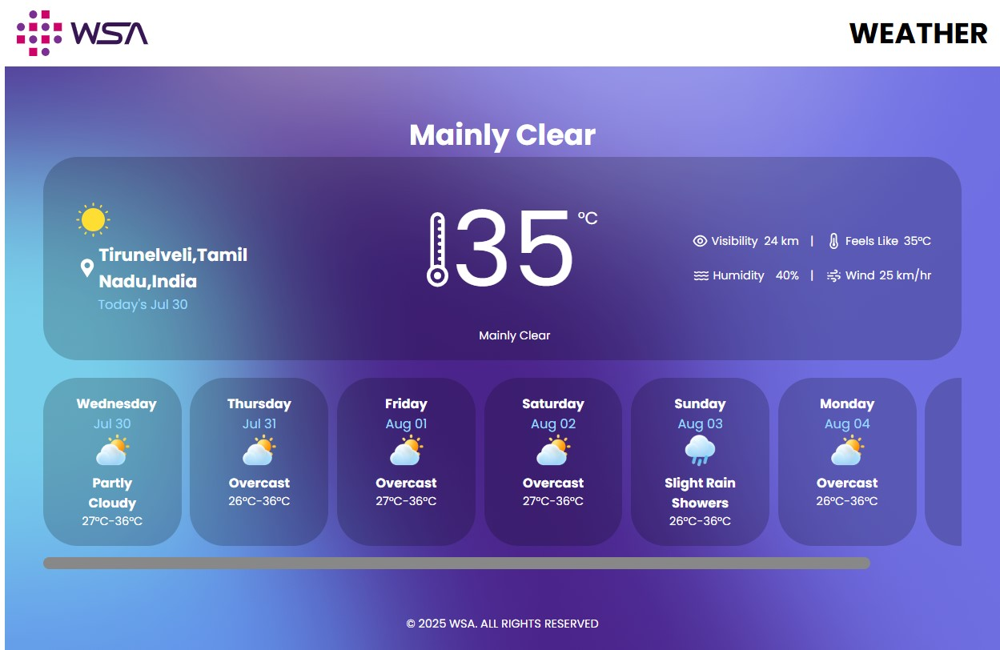
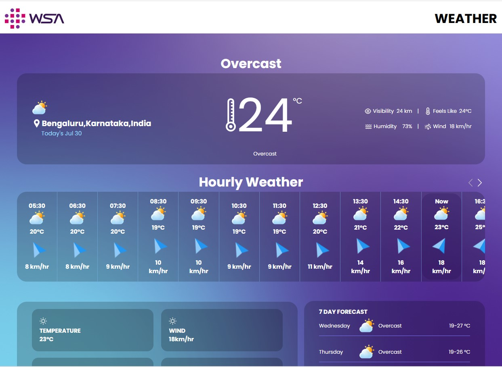

# WSA Weather App 

This project is part of the WSA Frontend Series and demonstrates the integration of **OpenStreetMap** using React. It is divided into two progressive levels:

- **Level 1**: Displaying a static map with a marker.
- **Level 2**: Enhanced interaction using user geolocation and improved UX.

## ✅ Tech Stack

| Name       | Description                     |
|------------|---------------------------------|
| React      | Component-based UI framework    |
| Leaflet.js | Interactive maps                |
| react-leaflet | Leaflet bindings for React   |
| HTML/CSS   | Markup and styling              |

## 📁 Project Structure

The repository contains two folders:

├── level1  
│ ├── src  
│ ├── public  
│ ├── package.json  
│ └── ...etc  
├── level2  
│ ├── src  
│ ├── public  
│ ├── package.json  
│ └── ...etc  

Each level is a standalone React app. Run them independently.

---

## ✅ Level 1 – Static Map Viewer

A simple Weather App that:

- Loads a map centered at a default location.
- Displays a marker at that location.
- Uses `react-leaflet` and `leaflet`.

✨ **Key Features**:

- Static coordinates (predefined)
- Basic marker view
- Clean layout using CSS

 **Screenshot**:

 **Live Demo**: [Click here to view Level 1](https://emertxeinfotech.github.io/wsa-weather-app/level1/)

---

## ✅ Level 2 – User Location & Interactivity

Level 2 enhances the basic viewer with:

- **Geolocation support** – Automatically centers the map on user's location.
- **Dynamic marker** based on geolocation.
- Improved UI/UX experience using Tailwind CSS (optional).
- Additional text showing coordinates.

✨ **Key Features**:

- Location permission handling
- Conditional rendering based on location availability
- Modular components

 **Screenshot**:

 **Live Demo**: [Click here to view Level 2](https://emertxeinfotech.github.io/wsa-weather-app/level2/)

---

## 📌 How to Run Locally

### For Level 1:
cd level1
npm install
npm run dev

### For Level 2:
cd level2
npm install
npm run dev

## 📄 License
© 2023 WSA. All rights reserved.
